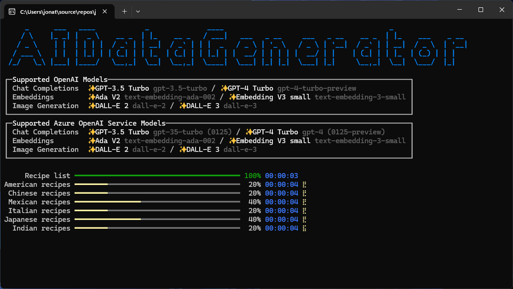

# AIDataGenerator

AIDataGenerator is a console app that uses generative AI to generate sample data for the catalog. Technologies used:

- [.NET](https://dotnet.microsoft.com/)
    - [Generic Host](https://learn.microsoft.com/dotnet/core/extensions/generic-host)
- [OpenAI](https://openai.com/) / [Azure OpenAI Service](https://azure.microsoft.com/products/ai-services/openai-service/) ([Azure SDK for .NET](https://github.com/Azure/azure-sdk-for-net))
    - [Chat Completions](https://platform.openai.com/docs/guides/text-generation/chat-completions-api) in [JSON Mode](https://platform.openai.com/docs/guides/text-generation/json-mode): [GPT-3.5 Turbo](https://platform.openai.com/docs/models/gpt-3-5) / [GPT-4 Turbo](https://platform.openai.com/docs/models/gpt-4-and-gpt-4-turbo)
    - [Image Generation](https://platform.openai.com/docs/guides/images): [DALL-E 2 / DALL-E 3](https://platform.openai.com/docs/models/dall-e)
- [Polly](https://github.com/App-vNext/Polly)
- [SkiaSharp](https://github.com/mono/SkiaSharp)
- [Spectre.Console](https://spectreconsole.net/)

## Configuration

Configuration can be provided in appsettings.json, user secrets, environment variables, or command line arguments. For more information, see: [Configuration Providers in .NET](https://learn.microsoft.com/dotnet/core/extensions/configuration-providers).

The following configuration options are available:

- AITextGenerator
    - Endpoint - **(Required for Azure OpenAI Service)** Azure OpenAI Service Endpoint
    - ApiKey - **(Required)** API key for OpenAI or Azure OpenAI Service
    - ChatCompletionsDeploymentName
        - OpenAI - Chat Completions model (defaults to gpt-3.5-turbo); supports gpt-3.5-turbo or gpt-4-turbo-preview
        - Azure OpenAI Service - **(Required)** Deployment name for Chat Completions model; supports gpt-35-turbo (0125) or gpt-4 (0125-preview)
    - EmbeddingsEndpoint - **(Azure OpenAI Service)** Azure OpenAI Service Endpoint to use for embeddings; Defaults to Endpoint
    - EmbeddingsApiKey - **(Azure OpenAI Service)** API key for Azure OpenAI Service Endpoint to use for embeddings; Defaults to ApiKey
    - EmbeddingsDeploymentName
        - OpenAI - Embeddings model (defaults to text-embedding-3-small); supports text-embedding-ada-002 or text-embedding-3-small
        - Azure OpenAI Service - **(Required)** Deployment name for Embeddings model; supports text-embedding-ada-002 or text-embedding-3-small
- AIImageGenerator
    - Endpoint - **(Required for Azure OpenAI Service)** Azure OpenAI Service Endpoint
    - ApiKey - **(Required)** API key for OpenAI or Azure OpenAI Service
    - DeploymentName
        - OpenAI - Image Generation model (defaults to dall-e-3); supports dall-e-2 or dall-e-3
        - Azure OpenAI Service - **(Required for DALL-E 3)** Deployment name for Image Generation model; supports dall-e-3
    - Size - Size of generated image (defaults to 1024x1024)
        - DALL-E 2 - Supports 256x256, 512x512, or 1024x1024
        - DALL-E 3 - Supports 1024x1024, 1024x1792, or 1792x1024
    - Quality - Quality of image; only supported with DALL-E 3; supports standard or hd
    - Style - Style of image; only supported with DALL-E 3; supports vivid or natural
- Worker
    - Cuisines - **(Required)** List of cuisines to generate recipes for (default values in appsettings.json)
    - RecipesPerCuisine - Number of recipes to generate for each cuisine
    - RecipeGenerationMaxConcurrency - Number of recipes to generate at the same time (defaults to 5)
    - ImageGenerationMaxConcurrency - Number of images to generate at the same time (defaults to 1)
    - ImageQuality - Image quality of saved image (defaults to 60)
